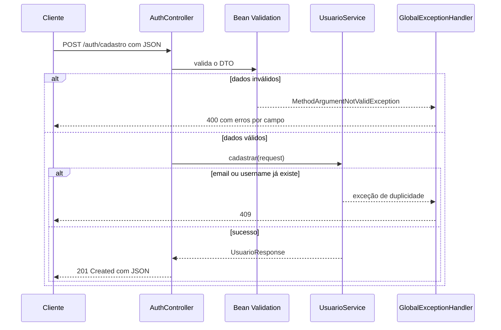

# AuthController: o endpoint de cadastro

> **Pasta de imagens:** crie uma pasta `img/` ao lado deste arquivo. Os blocos marcados com **[IMAGEM A ADICIONAR]** dizem o nome do arquivo e o que capturar. Os diagramas Mermaid renderizam no GitHub e no VS Code (com a extensão *Markdown Preview Mermaid Support*).

## 1. Responsabilidade da classe

O controller é a **porta de entrada HTTP** da aplicação. Ele traduz entre o mundo HTTP (rotas, JSON, status) e o mundo Java (objetos e chamadas de método).

| O controller **faz** | O controller **não faz** |
|---|---|
| Mapear a rota e o método HTTP | Regra de negócio |
| Receber o JSON como DTO e acionar a validação | Acessar o repository |
| Chamar o service | Gerar hash ou token |
| Escolher o status da resposta | Tratar exceções com `try/catch` (é do `GlobalExceptionHandler`) |

Um controller bom é **fino**: poucas linhas, todas sobre HTTP.

## 2. O código, anotação por anotação

```java
@RestController
@RequestMapping("/auth")
public class AuthController {

    @PostMapping("/cadastro")
    public ResponseEntity<UsuarioResponse> cadastrar(@Valid @RequestBody CadastroUsuarioRequest request) { ... }
}
```

| Anotação | O que significa |
|---|---|
| `@RestController` | Marca a classe como controller e faz os retornos virarem JSON no corpo da resposta |
| `@RequestMapping("/auth")` | Prefixo de rota para todos os métodos da classe |
| `@PostMapping("/cadastro")` | Este método responde a `POST /auth/cadastro` |
| `@RequestBody` | O corpo da requisição (JSON) é convertido para o DTO |
| `@Valid` | **Dispara a Bean Validation** sobre o DTO antes de o método executar |
| `ResponseEntity<T>` | Permite controlar status, cabeçalhos e corpo da resposta |

**Por que `POST`:** cadastro cria um recurso e não é idempotente. `GET` jamais deve ser usado, porque os dados iriam na URL (e em logs).

## 3. O que o Spring faz sozinho

- Registra a rota na inicialização.
- Usa o Jackson para converter JSON ↔ DTO.
- Roda a validação quando vê `@Valid`.
- Injeta o `UsuarioService` pelo construtor.
- Se o JSON for malformado, responde `400` por conta própria.

Você implementa manualmente: o mapeamento, a escolha do status e a chamada ao service.

## 4. Fluxo de uma requisição



## 5. Status HTTP usados

| Status | Quando | Quem produz |
|---|---|---|
| **201 Created** | Conta criada | Controller |
| **400 Bad Request** | DTO inválido ou JSON malformado | Validação / Spring |
| **409 Conflict** | Email ou username já cadastrado | `GlobalExceptionHandler` |
| 500 | Erro inesperado | Spring (sem detalhes ao cliente) |

## 6. O `GlobalExceptionHandler`

`@RestControllerAdvice` é um "controller de exceções" válido para a aplicação inteira. Cada `@ExceptionHandler` captura um tipo de exceção e devolve a resposta HTTP correspondente. Assim, nenhum controller precisa de `try/catch`.

- **`ProblemDetail`:** formato padrão do Spring (baseado na RFC 7807) para respostas de erro, com `status`, `detail` e propriedades extras. O erro de validação inclui um mapa `erros` com uma mensagem por campo.
- **`DataIntegrityViolationException`:** a resposta é fixa. A mensagem original do banco **não vai para o cliente**, porque pode revelar nomes de tabelas e índices.
- **Simplificação conhecida:** esse mesmo erro também ocorre em outras violações (por exemplo, `NOT NULL`). Como o DTO barra os nulos antes, tratamos tudo como conflito por enquanto. Refinaremos depois.
- **Armadilha evitada:** não criamos um `@ExceptionHandler(Exception.class)` genérico. Ele também capturaria erros do próprio Spring (JSON malformado, método HTTP errado) e os transformaria em `500`.

## 7. Roteiro de testes no Postman

Configuração: `POST http://localhost:8080/auth/cadastro`, aba *Body* → *raw* → *JSON*.

Antes: `$env:DB_PASSWORD = 'P@ssword'` e `.\mvnw.cmd spring-boot:run` no mesmo terminal.

| # | Teste | Corpo | Esperado |
|---|---|---|---|
| 1 | Cadastro válido | `{"email":"teste@gastromatch.com","username":"teste","password":"SenhaForte123"}` | **201**, JSON com `id`, `email`, `username`, `capa: null`, **sem `password`** |
| 2 | Email duplicado | repetir o teste 1 | **409** |
| 3 | Email com caixa diferente | mesmo email em maiúsculas, outro username | **409** (normalização funcionando) |
| 4 | Username duplicado | email novo, `"username":"teste"` | **409** |
| 5 | Email inválido | `"email":"abc"` | **400** com erro no campo `email` |
| 6 | Senha curta | `"password":"123"` | **400** com erro no campo `password` |
| 7 | Campos vazios | `{}` | **400** com erros nos três campos |
| 8 | JSON malformado | `{"email":` | **400** |
| 9 | Campo extra | adicionar `"id": 99` ao teste 1 com dados novos | **201**, e o `id` do banco **não** é 99 |

> 📷 **[IMAGEM A ADICIONAR 1]** — arquivo sugerido: `img/postman-cadastro-201.png`
> **O que capturar:** o teste 1 no Postman, mostrando a requisição, o status `201 Created` e o corpo da resposta (sem `password`).
>
> 

> 📷 **[IMAGEM A ADICIONAR 2]** — arquivo sugerido: `img/postman-cadastro-409.png`
> **O que capturar:** o teste 2 (email duplicado), com o status `409 Conflict`.
>
> 

> 📷 **[IMAGEM A ADICIONAR 3]** — arquivo sugerido: `img/postman-cadastro-400.png`
> **O que capturar:** o teste 7 (`{}`), mostrando o `400` e o mapa `erros` com as mensagens em português.
>
> 

> 📷 **[IMAGEM A ADICIONAR 4]** — arquivo sugerido: `img/log-sem-senha.png`
> **O que capturar:** o console da aplicação durante os testes. Confirme que a senha digitada **não aparece** em nenhuma linha de log.
>
> 

Conferência no banco depois dos testes: `SELECT id, email, username, password FROM usuarios;`. Deve haver **uma** linha para o teste 1.

## 8. O que este teste **não** prova

- **Não há Spring Security ainda.** O endpoint está aberto, e nenhum header de segurança, CSRF ou CORS está configurado. É esperado nesta etapa.
- **Não há HTTPS no ambiente local.** A senha trafega em texto puro no `localhost`. Em produção, o tráfego **deve** ser HTTPS.
- **Não há rate limiting.** Um script poderia criar milhares de contas. Isso entra na etapa 14.
- **Cadastro simultâneo** (o caminho da constraint `UNIQUE`) não é exercitado por testes manuais. Pode ser provocado com dois disparos quase simultâneos, e voltamos a isso nos testes de segurança.

Cadastro funcionando **não** significa autenticação segura.

## 9. Erros comuns

- Esquecer o `@Valid`: as anotações do DTO viram enfeite e dados inválidos passam.
- Confundir `jakarta.validation.Valid` com outro import.
- Esquecer o header `Content-Type: application/json` (o Postman faz isso sozinho ao escolher *raw → JSON*).
- Colocar lógica no controller (checar duplicidade, fazer hash).
- Devolver `Usuario` no lugar de `UsuarioResponse`.
- Testar só o caminho feliz.

## 10. Próximos passos para este controller

O `AuthController` também vai receber, nas próximas etapas:

| Rota | Depende de |
|---|---|
| `POST /auth/login` | `AuthService`, `JwtService` |
| `POST /auth/refresh` | refresh token no banco |
| `POST /auth/logout` | revogação do refresh token |

As operações sobre a **própria conta** (ver, editar, excluir) irão para o `UsuarioController`, com a rota `/usuarios/me`, quando o JWT existir.

## 11. Perguntas de consolidação

1. O que muda se eu tirar o `@Valid` do parâmetro do método?
2. Por que o controller não faz `try/catch` das exceções do service?
3. Por que o status de sucesso é `201` e não `200`?
4. Por que o `GlobalExceptionHandler` não devolve a mensagem original do `DataIntegrityViolationException`?
5. No teste 9, por que o `"id": 99` do JSON não chega ao banco?
