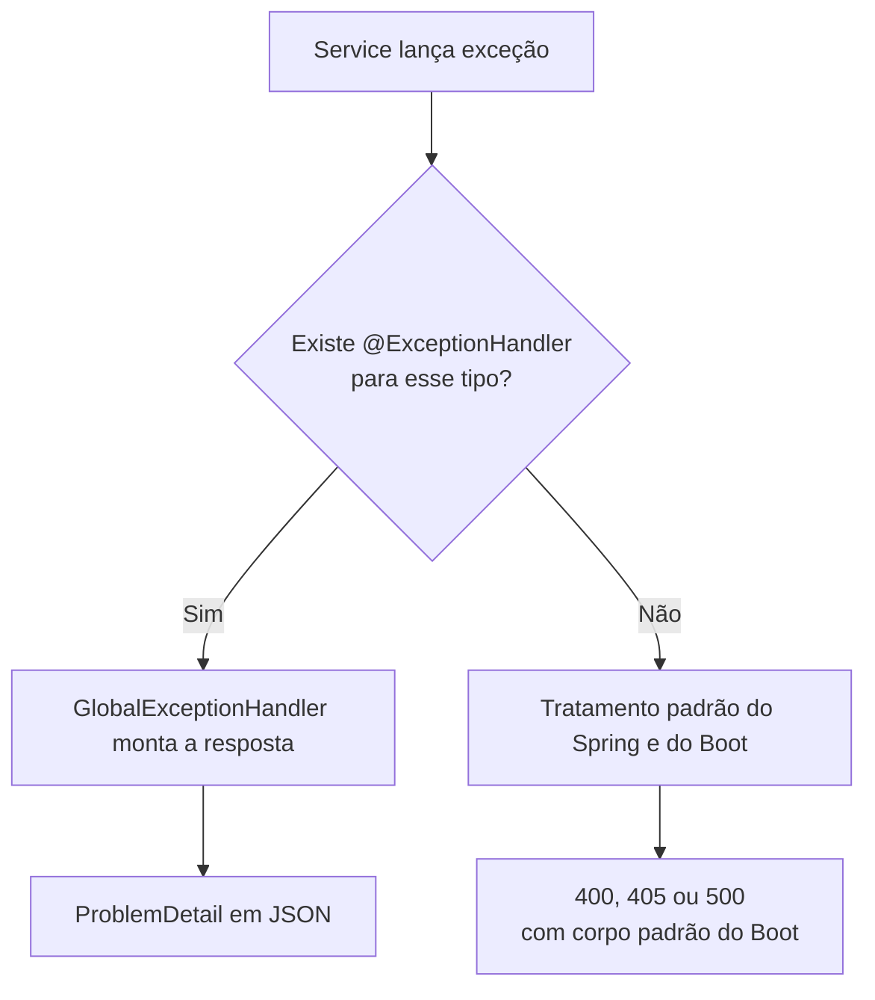
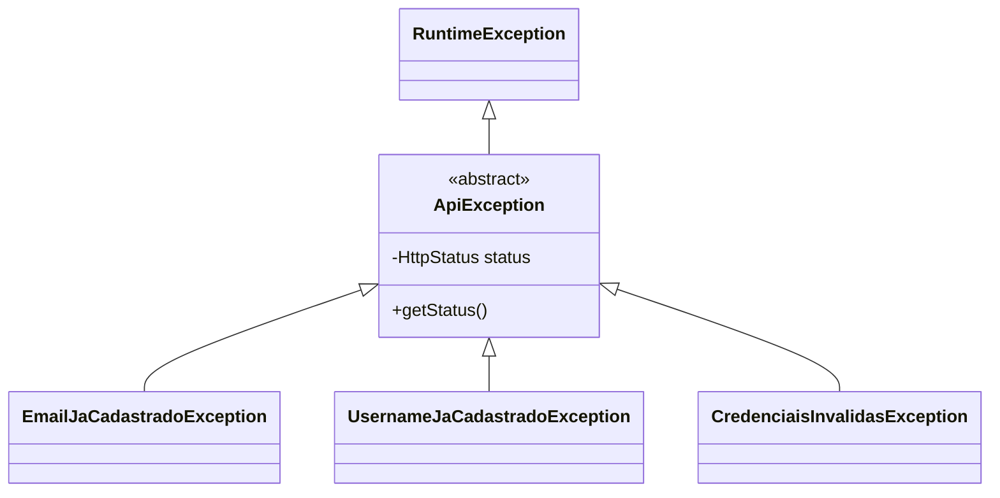

# ApiException e GlobalExceptionHandler: tratamento centralizado de erros

> **Pasta de imagens:** crie uma pasta `img/` ao lado deste arquivo. Os blocos marcados com **[IMAGEM A ADICIONAR]** dizem o nome do arquivo e o que capturar. Os diagramas Mermaid renderizam no GitHub e no VS Code (com a extensão *Markdown Preview Mermaid Support*).

## 1. O problema

Quando algo dá errado (email duplicado, dado inválido), o service precisa **avisar** e a API precisa **responder** com o status e o corpo corretos. Sem um desenho para isso, aparecem três problemas:

1. `try/catch` repetido em cada controller.
2. Respostas inconsistentes: cada endpoint inventa o seu formato de erro.
3. Vazamento: um erro não tratado pode expor detalhes internos (nomes de tabela, trechos de SQL, classes).

A solução é separar duas responsabilidades:

| Quem | Faz |
|---|---|
| **Service** | Lança a exceção ("email já cadastrado") e não sabe nada de HTTP |
| **Handler** | Converte a exceção em resposta HTTP (status e corpo) |

## 2. Como o Spring resolve uma exceção

Quando uma exceção escapa do controller, o Spring procura quem a trate:



**A regra de escolha é por tipo, com herança.** Um `@ExceptionHandler(X.class)` captura exceções do tipo `X` **e de qualquer subclasse de `X`**. Se vários handlers servirem, vence o do tipo **mais próximo** da exceção lançada. É a mesma lógica de um `catch`: `catch (IOException e)` também pega `FileNotFoundException`, mas não pega `SQLException`.

## 3. `ApiException`: a base

```java
public abstract class ApiException extends RuntimeException {

    private final HttpStatus status;

    protected ApiException(HttpStatus status, String message) {
        super(message);
        this.status = status;
    }

    public HttpStatus getStatus() { return status; }
}
```

| Escolha | Motivo |
|---|---|
| `abstract` | Não existe "erro genérico da API". Quem lança tem de escolher uma subclasse específica |
| `extends RuntimeException` | Não verificada: o service não declara `throws`, e o `@Transactional` faz rollback |
| `status` como `final`, sem setter | Definido na criação, não muda depois de lançada |
| Construtor `protected` | Só as subclasses o chamam |
| Importa `HttpStatus` | **Trade-off:** a exceção conhece um tipo do mundo web, em troca de um handler enxuto |

### As subclasses

```java
public class EmailJaCadastradoException extends ApiException {
    public EmailJaCadastradoException() {
        super(HttpStatus.CONFLICT, "Email já cadastrado");
    }
}
```

Cada subclasse tem 3 linhas e carrega o seu status. Adicionar uma exceção nova **não exige mexer no handler**.



## 4. `GlobalExceptionHandler`

```java
@RestControllerAdvice
public class GlobalExceptionHandler {

    @ExceptionHandler(ApiException.class)
    public ProblemDetail handleApi(ApiException ex) { ... }

    @ExceptionHandler(MethodArgumentNotValidException.class)
    public ProblemDetail handleValidacao(MethodArgumentNotValidException ex) { ... }

    @ExceptionHandler(DataIntegrityViolationException.class)
    public ProblemDetail handleIntegridade(DataIntegrityViolationException ex) { ... }
}
```

### A anotação da classe é obrigatória

`@RestControllerAdvice` faz duas coisas:

1. **Registra a classe** como bean e a torna válida para **todos os controllers**.
2. Faz o retorno (`ProblemDetail`) virar **JSON no corpo** da resposta.

**Sem ela, o código compila, a aplicação sobe sem erro e os handlers nunca são consultados.** O sintoma é uma exceção sem tratamento, que vira 500 em vez de 409.

### `ProblemDetail`

É o formato padrão do Spring (baseado na RFC 7807) para respostas de erro. A resposta sai com `Content-Type: application/problem+json` e tem aproximadamente esta forma (compare com a sua resposta real):

```json
{
  "type": "about:blank",
  "title": "Conflict",
  "status": 409,
  "detail": "Email já cadastrado",
  "instance": "/auth/cadastro"
}
```

No erro de validação, o handler acrescenta uma propriedade com uma mensagem por campo:

```json
{
  "status": 400,
  "detail": "Dados inválidos",
  "erros": {
    "email": "Email é obrigatório",
    "password": "Senha é obrigatória",
    "username": "Username é obrigatório"
  }
}
```

O `putIfAbsent` guarda só a **primeira** mensagem de cada campo, já que um campo pode violar várias regras ao mesmo tempo.

## 5. Quem lança, quem trata

| Origem da exceção | Exemplo | Handler | Status |
|---|---|---|---|
| **Nosso código** | `EmailJaCadastradoException` | `handleApi` | 409 |
| **Validação** (`@Valid`) | `MethodArgumentNotValidException` | `handleValidacao` | 400 |
| **Banco** (via Spring/Hibernate) | `DataIntegrityViolationException` | `handleIntegridade` | 409 |

### Por que `handleApi` não captura `DataIntegrityViolationException`, se as duas viram 409?

Porque o handler escolhe **pelo tipo da exceção** (herança), e não pelo status que ela acabará produzindo. O 409 é só o **resultado** da resposta, e não o critério de escolha.

- `ApiException` e suas filhas são **nossas**: a linhagem delas termina em `RuntimeException`, passando por `ApiException`.
- `DataIntegrityViolationException` é do **Spring**, da família `DataAccessException`. Ela é lançada quando o MySQL rejeita um `INSERT` (por exemplo, violação do `UNIQUE`). Não tem nenhum parentesco com `ApiException`.

Como não há relação de herança, `@ExceptionHandler(ApiException.class)` não a enxerga. Por isso ela precisa de handler próprio.

## 6. Dois caminhos para o mesmo 409

| Caminho | Quando acontece | Característica |
|---|---|---|
| Checagem no service (`existsByEmail` → `ApiException`) | Caso normal | Mensagem específica, antes de qualquer `INSERT` |
| `UNIQUE` do banco (`DataIntegrityViolationException`) | Dois cadastros simultâneos | Última barreira, mensagem genérica |

O segundo caminho existe porque duas requisições podem passar pela checagem ao mesmo tempo, antes que qualquer uma tenha salvo. Quem desempata é o banco.

## 7. Cuidados de segurança

- **A mensagem da exceção vai para o cliente.** Nunca coloque nela SQL, nomes de tabela, stack trace, nem o próprio email digitado em fluxos sensíveis.
- **No `DataIntegrityViolationException`, a mensagem original do banco não é repassada.** Ela costuma conter o nome da tabela e do índice.
- **Não criamos `@ExceptionHandler(Exception.class)` genérico.** Ele capturaria também erros do próprio Spring (JSON malformado, método HTTP errado) e os transformaria em 500.
- **Enumeração de contas:** no cadastro, "email já cadastrado" revela que a conta existe. É um trade-off de usabilidade, mitigado depois com rate limiting. No **login**, a regra é uma mensagem **única e genérica**.
- **Os detalhes técnicos ficam no log do servidor**, não na resposta.

## 8. Diagnóstico: sintomas de cada falha

| O que está errado | Sintoma |
|---|---|
| `GlobalExceptionHandler` sem `@RestControllerAdvice` | Exceções de negócio viram **500**, e o corpo é o padrão do Boot |
| `throw` comentado no service | O código segue até o `save`, o `UNIQUE` barra e o resultado é **500** (ou 409, se o handler de integridade existir) |
| Validação sem o handler dedicado | **400**, mas o corpo não traz o mapa `erros` |
| `handleConflito` antigo junto com `handleApi` | Funciona, mas o código fica duplicado e confuso |
| `@Valid` ausente no controller | Dados inválidos **passam**, sem erro nenhum |
| Esquecer o `extends ApiException` numa exceção | `throw` nem compila, ou cai em 500 |

> 📷 **[IMAGEM A ADICIONAR 1]** — arquivo sugerido: `img/console-500-antes.png`
> **O que capturar:** o estado **antes** da correção (handler sem a anotação ou `throw` comentado): o Postman com `500` no teste de email duplicado, e o console com a exceção `DataIntegrityViolationException` e a mensagem `Duplicate entry`. Serve para comparar com o resultado depois.
>
> 

## 9. Resultado esperado depois de tudo certo

| # | Teste | Esperado |
|---|---|---|
| 1 | Cadastro válido | **201**, sem `password` |
| 2 | Email duplicado | **409**, `detail`: "Email já cadastrado" |
| 3 | Email em caixa diferente | **409** |
| 4 | Username duplicado | **409**, `detail`: "Username já cadastrado" |
| 5 | Email inválido | **400**, erro no campo `email` |
| 6 | Senha curta | **400**, erro no campo `password` |
| 7 | Corpo `{}` | **400**, erros nos três campos |
| 8 | JSON malformado | **400** (tratamento padrão do Spring) |

> 📷 **[IMAGEM A ADICIONAR 2]** — arquivo sugerido: `img/postman-409-apiexception.png`
> **O que capturar:** o teste 2 no Postman, com o status `409 Conflict`, o corpo `ProblemDetail` e o cabeçalho `Content-Type: application/problem+json`.
>
> 

> 📷 **[IMAGEM A ADICIONAR 3]** — arquivo sugerido: `img/postman-400-erros.png`
> **O que capturar:** o teste 7 (`{}`), mostrando `400` e o mapa `erros` com uma mensagem por campo.
>
> 

Confira também no console que, nos testes 2 a 4, **não** aparece um `insert`. Se aparecer, o `throw` do service não foi alcançado.

## 10. Erros comuns

- Esquecer `@RestControllerAdvice` na classe.
- Deixar o `if` do service vazio ou com o `throw` comentado.
- Criar um handler genérico para `Exception`.
- Devolver `ex.getMessage()` de exceções do framework ao cliente.
- Misturar o handler antigo (lista de classes) com o novo (`ApiException`).
- Esquecer que erros do framework (validação, banco) **não** herdam de `ApiException`.

## 11. Perguntas de consolidação

1. O que acontece se a classe `GlobalExceptionHandler` não tiver `@RestControllerAdvice`?
2. Por que `handleApi` não captura a `DataIntegrityViolationException`?
3. Por que nunca devolvemos a mensagem original do banco ao cliente?
4. Por que `ApiException` é `abstract`?
5. Em qual situação o `UNIQUE` do banco é o único que impede a duplicata, e o service não?