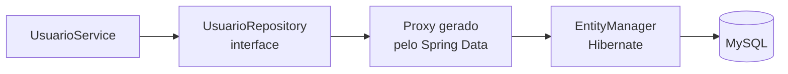
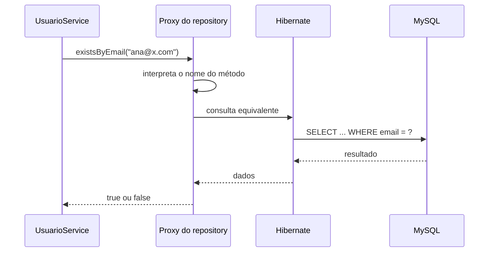
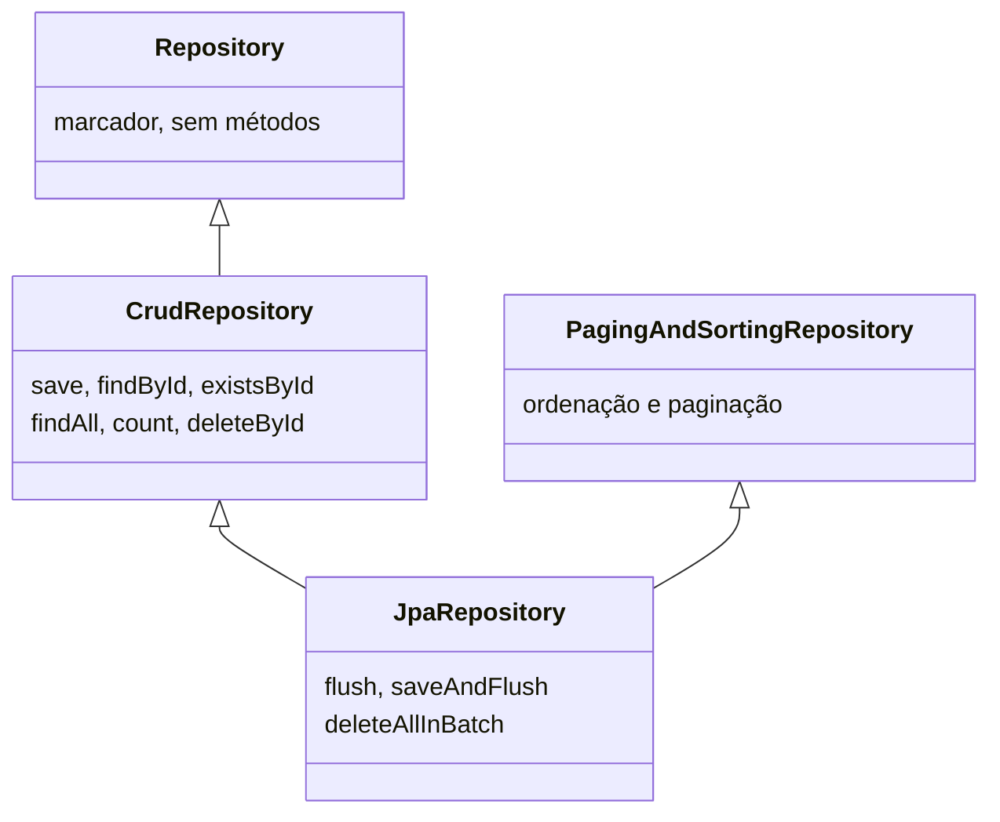

# Repository e JpaRepository

> **Pasta de imagens:** crie uma pasta `img/` ao lado deste arquivo. Os blocos marcados com **[IMAGEM A ADICIONAR]** dizem o nome do arquivo e o que capturar. Os diagramas Mermaid renderizam no GitHub e no VS Code (com a extensão *Markdown Preview Mermaid Support*).

## 1. O papel do repository

O repository é a **camada de acesso a dados**: o único lugar que sabe como buscar e gravar `Usuario` no banco. O service pergunta "existe esse email?", sem saber como isso vira SQL.



## 2. Por que o repository é uma interface?

Uma interface é um **contrato**: diz *o que* pode ser pedido, sem dizer *como*. Uma classe precisa dizer o como. Veja o que você escreveria sem o Spring Data:

```java
@Repository
public class UsuarioRepositoryManual {

    @PersistenceContext
    private EntityManager em;

    public Usuario salvar(Usuario usuario) {
        em.persist(usuario);
        return usuario;
    }

    public Optional<Usuario> buscarPorEmail(String email) {
        return em.createQuery("SELECT u FROM Usuario u WHERE u.email = :email", Usuario.class)
                 .setParameter("email", email)
                 .getResultStream()
                 .findFirst();
    }

    // ...e um bloco parecido para cada operação: existePorEmail, existePorUsername, buscarPorId...
}
```

Com o Spring Data, você declara só o contrato:

```java
public interface UsuarioRepository extends JpaRepository<Usuario, Long> {
    Optional<Usuario> findByEmail(String email);
    boolean existsByEmail(String email);
    boolean existsByUsername(String username);
}
```

E o Spring **escreve a implementação por você, na inicialização**. Isso só é possível porque é uma interface: ela não tem corpo, então o Spring pode encaixar a implementação que ele mesmo gera. Se fosse uma classe, o corpo dos métodos já teria de existir.

## 3. Como o Spring Data cria a implementação

Na inicialização da aplicação:

1. O Spring Boot configura o Spring Data JPA automaticamente e varre os pacotes a partir da classe com `@SpringBootApplication` (aqui, `com.gastromatch`), procurando interfaces que estendem `Repository`.
2. Para cada uma, cria um **proxy**: um objeto gerado em tempo de execução que implementa a interface e intercepta as chamadas.
3. O proxy decide o que fazer com cada chamada:
   - **métodos herdados** (`save`, `findById`, `findAll`...) são delegados a uma implementação pronta do Spring Data (`SimpleJpaRepository`), que usa o `EntityManager` do Hibernate;
   - **métodos que você declarou** (`findByEmail`, `existsByEmail`...) têm o **nome analisado** e convertido em uma consulta.
4. O proxy é registrado como bean, e o Spring o entrega ao construtor do `UsuarioService`.



**Ponto de atenção:** se a interface estiver fora de `com.gastromatch` (ou de seus subpacotes), o Spring não a encontra, e o bean não existe.

## 4. O que é `JpaRepository<Usuario, Long>`

`JpaRepository` é uma interface do Spring Data que traz um conjunto pronto de operações. Os dois tipos entre `< >` são:

| Parâmetro | Significado | Aqui |
|---|---|---|
| 1º | A **entidade** gerenciada | `Usuario` |
| 2º | O **tipo do `@Id`** da entidade | `Long` |

Tipo de id errado (por exemplo, `Integer` com `@Id Long`) causa erros em operações como `findById`.

Estrutura simplificada da herança (confira a real na sua IDE: Ctrl+clique em `JpaRepository`):



> 📷 **[IMAGEM A ADICIONAR 1]** — arquivo sugerido: `img/ide-jparepository-hierarchy.png`
> **O que capturar:** na IDE, a hierarquia de tipos de `JpaRepository` (no VS Code, Ctrl+clique em `JpaRepository` e abra o arquivo, ou use *Show Type Hierarchy*), para ver as interfaces que ele herda.
>
> 

### Métodos herdados mais usados

| Método | O que faz |
|---|---|
| `save(entidade)` | Insere (id nulo) ou atualiza (id existente) |
| `findById(id)` | Busca por chave primária, devolve `Optional` |
| `findAll()` | Lista todos |
| `existsById(id)` | `true` ou `false` |
| `count()` | Quantidade de registros |
| `deleteById(id)` | Remove pelo id |

### Como o `save` decide entre INSERT e UPDATE

- Se a entidade é **nova** (id `null`): o Hibernate faz `persist`, que gera um `INSERT`. Com `GenerationType.IDENTITY`, o INSERT acontece imediatamente e o id gerado pelo MySQL é preenchido no objeto.
- Se já **tem id**: o Hibernate faz `merge`, que normalmente consulta o registro e gera um `UPDATE`.

O `save` **devolve a instância gerenciada**. Por isso o service usa o retorno (`Usuario salvo = usuarioRepository.save(usuario)`), e não o objeto original: é o retorno que garante o estado atual, com o id.

## 5. Métodos por convenção de nome

O Spring lê o nome do método e monta a consulta:

| Nome do método | Consulta equivalente |
|---|---|
| `findByEmail(String)` | `WHERE email = ?` |
| `existsByEmail(String)` | verifica se há ao menos uma linha com esse email |
| `findByEmailAndUsername(...)` | `WHERE email = ? AND username = ?` |
| `findByUsernameContaining(...)` | `WHERE username LIKE %?%` |
| `countByCapaIsNull()` | contagem onde `capa IS NULL` |

Regras:

- O nome é montado com **nomes de atributos da entidade** (`email`, `username`), não com nomes de colunas.
- Prefixos: `findBy`, `existsBy`, `countBy`, `deleteBy`. Conectores: `And`, `Or`.
- O tipo de retorno acompanha o prefixo: `Optional<T>` ou `T` para `findBy`, `boolean` para `existsBy`, `long` para `countBy`.
- Um atributo escrito errado (`findByEmial`) **não dá erro de compilação**: a aplicação falha ao **subir**, com uma mensagem do tipo *No property 'emial' found for type 'Usuario'*.
- Quando o nome fica longo ou a consulta é complexa, use `@Query` com JPQL.

## 6. Por que o `JpaRepository` não fica no service?

1. **O service é uma classe com regras de negócio.** Para "ter" os métodos do `JpaRepository`, ele teria de implementar a interface e escrever cerca de vinte métodos. O objetivo do Spring Data é justamente fazer isso por você, e ele só consegue fazer em uma **interface** sem corpo.
2. **Responsabilidades separadas.** O service decide *o que fazer* (normalizar, checar duplicidade, aplicar hash). O repository decide *como falar com o banco*. Se o acesso a dados mudar, as regras não são tocadas.
3. **Exposição de operações.** Um service que herdasse `JpaRepository` passaria a ter `deleteAll()` e outros métodos que não fazem parte das suas regras.
4. **Reuso.** O `UsuarioService` e o futuro `AuthService` vão precisar de `findByEmail`. Um repository separado é injetado nos dois.
5. **Testes.** Com o repository separado, é possível testar o service substituindo-o por um objeto falso, sem banco de dados.

## 7. Transações

Os métodos que o `SimpleJpaRepository` oferece já são transacionais (os de leitura, somente leitura). Quando o service tem `@Transactional`, as chamadas ao repository **participam da mesma transação** do service. Isso permite que, por exemplo, uma exceção depois do `save` desfaça o `INSERT` (rollback).

## 8. Como ver o SQL real

Com `spring.jpa.show-sql=true` no `application.properties`, o console mostra o SQL que o Hibernate executa.

**Exercício:** faça um cadastro pelo Postman e leia o console. Você deve ver, em ordem, algo equivalente a:

1. uma consulta de existência pelo email;
2. uma consulta de existência pelo username;
3. um `insert into usuarios ...`.

Anote qual método do service gerou cada uma.

> 📷 **[IMAGEM A ADICIONAR 2]** — arquivo sugerido: `img/console-sql-cadastro.png`
> **O que capturar:** o console da aplicação logo depois de um cadastro, mostrando os `select` e o `insert`.
>
> 

## 9. Alternativas

| Alternativa | Quando considerar |
|---|---|
| `@Query` (JPQL ou SQL nativo) | Consulta que o nome do método não expressa bem |
| `EntityManager` direto | Controle total, mais código |
| `JdbcTemplate` / `JdbcClient` | SQL puro, sem JPA |
| Specifications | Filtros dinâmicos combinados |

Para o GastroMatch, o `JpaRepository` com métodos por nome cobre o cadastro e o login.

## 10. Erros comuns

- Atributo errado no nome do método (a falha só aparece ao subir a aplicação).
- Usar o nome da coluna em vez do nome do atributo da entidade.
- Interface fora do pacote varrido pelo Spring Boot.
- Tipo do id diferente do `@Id` da entidade.
- Retornar `Usuario` em vez de `Optional<Usuario>`: sem registro, vem `null`, e o `NullPointerException` aparece longe da causa.
- Tentar `new UsuarioRepository()`: interface não se instancia, quem fornece o objeto é o Spring.
- Esquecer que `findBy...` com retorno único e mais de um resultado lança exceção. No nosso caso, o `UNIQUE` do email evita isso.

## 11. Perguntas de consolidação

1. Por que o Spring Data consegue gerar a implementação de uma interface, mas não de uma classe?
2. O que o Spring faz com o método `existsByUsername` quando a aplicação sobe?
3. Por que o service usa o retorno do `save` e não o objeto que enviou?
4. O que acontece se eu escrever `existsByUsrname`? Em que momento o erro aparece?
5. Por que o `UsuarioService` e o `AuthService` podem compartilhar o mesmo repository sem duplicar código?