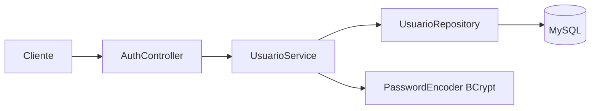
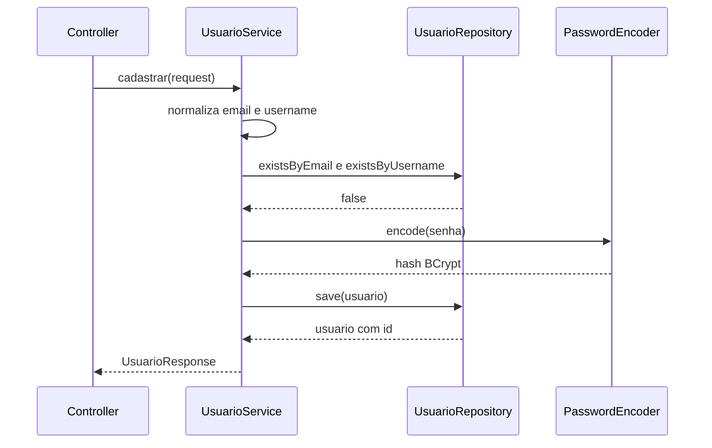

# UsuarioService: cadastro de usuários

> **Pasta de imagens:** crie uma pasta `img/` ao lado deste arquivo. Os blocos marcados com **[IMAGEM A ADICIONAR]** dizem o nome do arquivo e o que capturar. Os diagramas Mermaid renderizam no GitHub e no VS Code (com a extensão *Markdown Preview Mermaid Support*).

## 1. Responsabilidade da classe

O `UsuarioService` guarda as **regras de negócio sobre usuários**. Ele fica entre o controller e o repository:



| O service **faz** | O service **não faz** |
|---|---|
| Normalizar email e username | Ler HTTP, status code ou JSON (é do controller) |
| Verificar duplicidade | Escrever SQL (é do repository) |
| Gerar o hash da senha | Gerar JWT (será do `JwtService`) |
| Converter entidade em DTO de resposta | Controlar login e logout (será do `AuthService`) |

## 2. Escopo desta versão: só o cadastro

Ver, editar e deletar "a própria conta" dependem de saber **quem está logado**, e isso vem do JWT e do Spring Security. Por isso entram depois. O mapa:

| Operação | Método previsto | Depende de | Etapa |
|---|---|---|---|
| **Criar conta** | `cadastrar` | BCrypt, repository | **Agora** |
| Ver a própria conta | `buscarPerfilAutenticado` | Usuário vindo do token (SecurityContext) | 11 |
| Ver outras contas | `buscarPerfilPublico(id)` | DTO de perfil público (sem email) | após 11 |
| Editar a própria conta | `atualizar` | Token; regras de senha, email e username | após 11 |
| Alterar senha | `alterarSenha` | Senha atual; revogar refresh tokens | 12 |
| Deletar a própria conta | `excluir` | Política (apagar ou desativar); revogar tokens | após 12 |
| Sair (logout) | no `AuthService` | Refresh token no banco | 13 |
| Restaurante e receita (chef) | `RestauranteService`, `ReceitaService` | Role e outras entidades | fora deste módulo |

**Regra de segurança que vale para todas as operações "da própria conta":** o id do usuário vem do **token**, nunca de um id enviado pelo cliente. Caso contrário, qualquer usuário logado altera a conta de outro (falha conhecida como IDOR).

## 3. Dependências e injeção por construtor

```java
private final UsuarioRepository usuarioRepository;
private final PasswordEncoder passwordEncoder;

public UsuarioService(UsuarioRepository usuarioRepository, PasswordEncoder passwordEncoder) { ... }
```

- **O que o Spring faz sozinho:** ao subir, ele cria o `UsuarioRepository` (gera a implementação) e o `PasswordEncoder` (bean declarado no `SecurityConfig`) e os entrega ao construtor. Com um único construtor, não é preciso `@Autowired`.
- **Por que `final` e construtor:** a classe não consegue existir sem as dependências, e os testes podem criá-la com `new UsuarioService(...)` passando objetos falsos.
- **Alternativa:** `@Autowired` no campo. Funciona, mas esconde as dependências e dificulta o teste.

## 4. O método `cadastrar` passo a passo

1. **Normalização.** `email.trim().toLowerCase(Locale.ROOT)`. Sem isso, `Ana@x.com` e `ana@x.com` virariam duas contas. `Locale.ROOT` evita que o idioma da máquina altere a conversão (o clássico problema do "I" turco). O username só ganha `trim()`.
2. **Checagem de duplicidade.** `existsByEmail` e `existsByUsername`. Resposta clara para o usuário, com `409`.
3. **Montar a entidade.** Construtor vazio e setters.
4. **Hash da senha.** `passwordEncoder.encode(request.password())`. A senha pura existe apenas dentro do DTO e some depois.
5. **Salvar.** `save` executa o `INSERT`. Com `GenerationType.IDENTITY`, o INSERT é imediato, e o id volta preenchido no objeto.
6. **Converter para `UsuarioResponse`.** Copiando só id, email, username e capa.



## 5. `@Transactional`

Uma transação agrupa operações no banco: ou tudo é confirmado (*commit*), ou tudo é desfeito (*rollback*).

- Por padrão, uma `RuntimeException` dentro do método provoca rollback.
- Aqui há só um `INSERT`, então o ganho é pequeno, mas o hábito é correto: quando o cadastro ganhar mais passos (criar refresh token, registrar auditoria), eles se tornam atômicos.
- O import correto é `org.springframework.transaction.annotation.Transactional`.

## 6. Concorrência: por que a checagem não basta

Imagine dois cadastros simultâneos com o mesmo email:

```
Requisição A: existsByEmail → false
Requisição B: existsByEmail → false     (A ainda não salvou)
Requisição A: save → ok
Requisição B: save → ???
```

As duas passaram pela checagem. Quem impede a duplicata é a **constraint `UNIQUE`** do banco: o `save` da requisição B falha com `DataIntegrityViolationException`. O `GlobalExceptionHandler` traduz isso para `409`, sem expor a mensagem do banco.

Resumo das barreiras: DTO (formato) → service (duplicidade com mensagem clara) → banco (garantia final).

## 7. BCrypt

- **Hash, não criptografia.** Não existe operação inversa. Para conferir uma senha, o BCrypt gera o hash da senha digitada e compara.
- **Salt embutido.** Cada `encode` gera um salt aleatório e o guarda dentro do próprio hash. A mesma senha gera hashes diferentes a cada vez, o que anula tabelas pré-calculadas.
- **Custo.** O formato `$2a$10$...` indica o algoritmo e o custo (10 = 2¹⁰ rodadas). Custo maior deixa cada verificação mais lenta, o que dificulta ataques de força bruta. O ajuste correto deve ser medido no servidor real, e não escolhido ao acaso.
- **Tamanho.** O hash tem 60 caracteres (a coluna `password` tem 100).
- **Limite de 72 bytes.** O BCrypt só considera os primeiros 72 bytes da senha. O DTO limita em 72 *caracteres*, e caracteres acentuados ocupam mais de 1 byte. É uma **lacuna conhecida**: senhas muito longas e com acentos ou emojis podem ser truncadas silenciosamente. Não é falha de autenticação, mas reduz a entropia além do corte. Decidimos como tratar na etapa de proteções complementares.
- **Por que um `@Bean`?** Um único `PasswordEncoder` compartilhado na aplicação, e trocar de algoritmo no futuro (por exemplo, Argon2id) significa mudar uma linha em um só lugar.

## 8. Exceções

`EmailJaCadastradoException` e `UsernameJaCadastradoException` estendem `RuntimeException` (não verificadas): o service não precisa declarar `throws`, e o `@Transactional` faz rollback automaticamente. Quem transforma a exceção em resposta HTTP é o `GlobalExceptionHandler`, e não o service.

## 9. Decisões e trade-offs

- **Enumeração de contas no cadastro.** Responder "email já cadastrado" permite descobrir quais emails têm conta. É um trade-off comum de usabilidade. Mitigações futuras: rate limiting (etapa 14) ou fluxo de verificação por email, em que a resposta é sempre a mesma.
- **Validação antes do `trim`.** O DTO valida o tamanho do username *antes* do `trim`, então `"  ab "` passa pela validação e vira `"ab"`. Refinamento possível: validar depois de normalizar.
- **Nenhum `save` de objeto vindo do cliente.** O `Usuario` é sempre montado campo a campo no service, por isso o cliente não consegue injetar `id` nem, no futuro, uma `role`.

## 10. Como verificar

**Cadastro feito no Postman e conferido no MySQL:**

```sql
SELECT id, email, username, password FROM usuarios;
```

Confira: o email está em minúsculas, o `password` começa com `$2a$10$` e tem 60 caracteres, e **não** é a senha digitada.

> 📷 **[IMAGEM A ADICIONAR 1]** — arquivo sugerido: `img/mysql-usuarios-hash.png`
> **O que capturar:** o resultado do `SELECT` acima, mostrando a coluna `password` com o hash.
>
> 

> 📷 **[IMAGEM A ADICIONAR 2]** — arquivo sugerido: `img/mysql-show-create-table.png`
> **O que capturar:** o resultado de `SHOW CREATE TABLE usuarios;`, com os índices `UNIQUE` de `email` e `username`.
>
> 

**Experimento sobre o salt:** cadastre dois usuários diferentes com a **mesma senha** e compare os hashes no banco. Devem ser diferentes. Anote por quê.

## 11. Erros comuns

- Salvar `request.password()` direto na entidade (senha pura no banco).
- Esquecer o `toLowerCase` e criar contas duplicadas por diferença de caixa.
- Checar duplicidade e não ter `UNIQUE` no banco.
- Devolver a entidade em vez do `UsuarioResponse`.
- Importar `Transactional` de `jakarta.transaction` em vez do pacote do Spring (funciona, mas com semântica diferente).
- Logar o `request` inteiro (o `toString` do DTO já omite a senha, mas o hábito importa).

## 12. Perguntas de consolidação

1. Por que o service faz a checagem `existsByEmail` se o banco já tem `UNIQUE`?
2. O que significa o `10` em `$2a$10$...`?
3. Por que a mesma senha gera hashes diferentes?
4. Por que as operações "da própria conta" não podem receber o id pela URL?
5. O que acontece com o `INSERT` se uma exceção for lançada depois do `save`, dentro do método?
